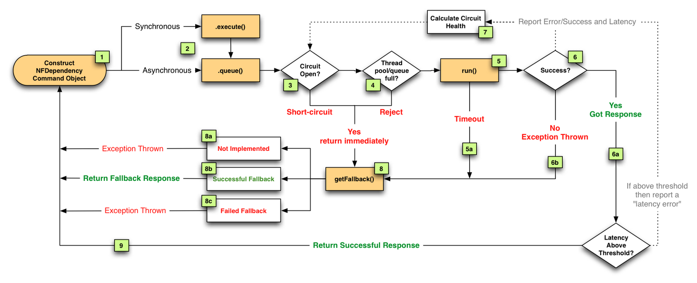

# Spring Cloud MSA

## 12 Factors
|#|팩터(영어)|팩터(한국어)|설명|
|--- |--- |--- |--- |
|1|Codebase|코드베이스 |단일 코드베이스. 버전 관리되는 하나의 코드베이스와 다양한 배포. 개발/테스트/운영서버(인스턴스)는 동일한 코드 기반이어야 함|
|2|Dependencies|의존성|명시적으로 선언되고 분리된 의존성. 필요한 의존성을 애플리케이션과 함께 담음|
|3|Config|설정 |환경설정은 분리하여 외부에 보관. 소스코드(코드베이스)는 하나, 환경(개발/테스트/운영)에 따라 설정만 바꿔야 함|
|4|Backing Services|백엔드 서비스|백엔드 서비스를 연결된 리소스로 취급. URL을 통해 접근(바인딩)되어야 함|
|5|Build, release, run|빌드, 릴리즈, 실행|분리된 빌드와 실행 단계를 가져야 함|
|6|Stateless process|무상태 프로세스 |애플리케이션을 하나 혹은 여러개의 무상태 프로세스로 실행. 상태는 외부저장소에 보관|
|7|Port binding|포트 바인딩 |포트 바인딩을 사용해서 서비스 노출. 별도의 웹서버를 두지 않고 자기완결적으로 서비스 제공|
|8|Concurrency|동시성 |프로세스 모델을 사용한 확장(scale out). 프로세스가 복제를 통해 확장될 수 있게 설계해야 함|
|9|Disposability|폐기 가능 |빠른 시작과 그레이스풀 셧다운(graceful shutdown)을 통한 안정성 극대화|
|10|Dev/prod parity|dev/prod 일치|development, staging, production 환경을 최대한 동일하게 유지|
|11|Logs|로그 |로그를 이벤트 스트림으로 취급. 로컬서버에 저장하지 말고 중앙저장소로 수집|
|12|Admin processes|Admin 프로세스|admin/maintenance 작업을 일회성 프로세스로 실행|

## Spring-Cloud, Netflix OSS

### Failure as a First Class Citizen
- 모놀리틱은 의존성 호출 100%신뢰
- 이에 반하여 MSA는 실패가능성이 있다.
- 이러한 실패 또한 1급 객체로 취급해야한다.

### Hystrix 
- Circuit Breaker
- Circuit Open
  - = Fail Fast
  - 전체적인 시스템 장애가 되지 않도록 중간에서 막아준다.
  - 호출 에러를 통계를 내고, 임계값을 넘긴다면 Circuit Open한다.
- Fallback
  - 모든 실패에 대해 대처법을 명시한다.

- Hystrix - Circuit Breaker WorkFlow
  - [링크](https://netflixtechblog.com/fault-tolerance-in-a-high-volume-distributed-system-91ab4faae74a)

## [Step 2] Hystrix 사용하기
- Display -> Product 연동 구간에 Circuit Breaker를 적용한다.

