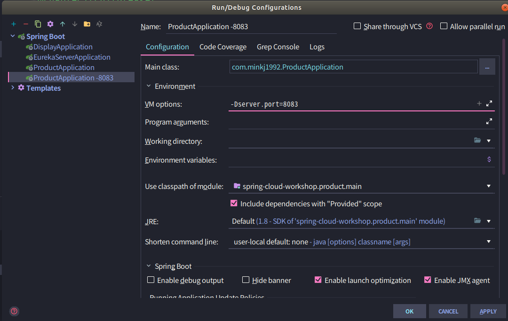
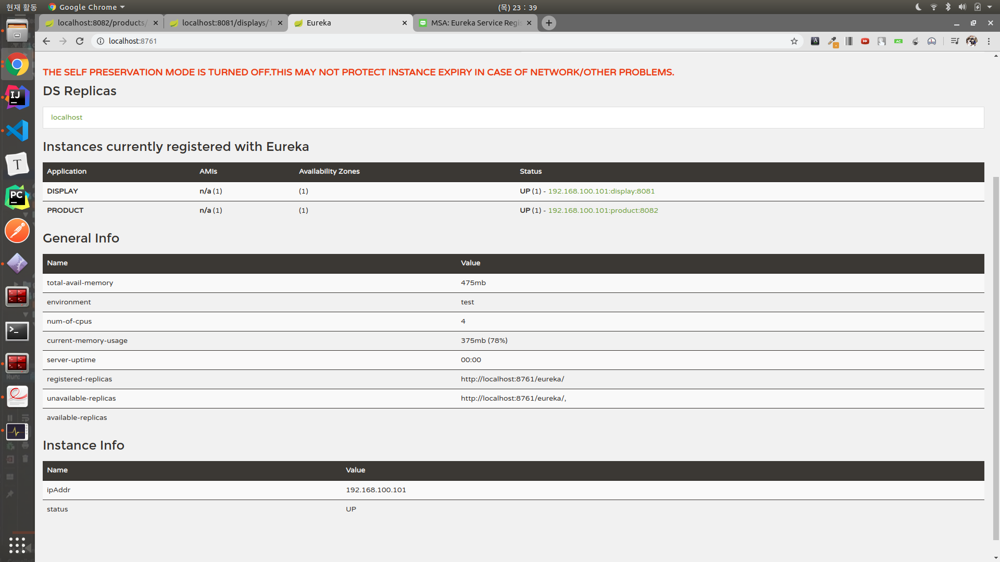
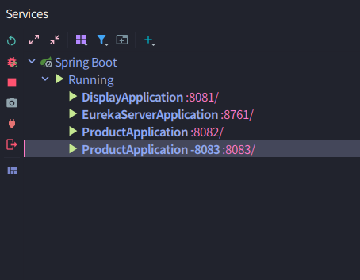
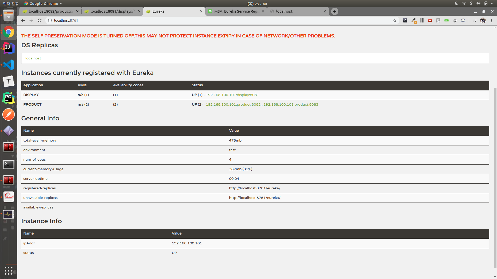

# Spring Cloud MSA
> Spring-cloud(hystrix, Ribbon) + Zuul(API Gateway) 기반의 MSA 서비스

- [MSA 전반적인 글](https://futurecreator.github.io/2018/09/14/what-is-microservices-architecture/)

## DB 분리
- `CDC`(`Linkedin` 방식)
  - command로 찍어내어 중앙의 `Kafka`에 기록한다.

## 12 Factors
|#|팩터(영어)|팩터(한국어)|설명|
|--- |--- |--- |--- |
|1|Codebase|코드베이스 |단일 코드베이스. 버전 관리되는 하나의 코드베이스와 다양한 배포. 개발/테스트/운영서버(인스턴스)는 동일한 코드 기반이어야 함|
|2|Dependencies|의존성|명시적으로 선언되고 분리된 의존성. 필요한 의존성을 애플리케이션과 함께 담음|
|3|Config|설정 |환경설정은 분리하여 외부에 보관. 소스코드(코드베이스)는 하나, 환경(개발/테스트/운영)에 따라 설정만 바꿔야 함|
|4|Backing Services|백엔드 서비스|백엔드 서비스를 연결된 리소스로 취급. URL을 통해 접근(바인딩)되어야 함|
|5|Build, release, run|빌드, 릴리즈, 실행|분리된 빌드와 실행 단계를 가져야 함|
|6|Stateless process|무상태 프로세스 |애플리케이션을 하나 혹은 여러개의 무상태 프로세스로 실행. 상태는 외부저장소에 보관|
|7|Port binding|포트 바인딩 |포트 바인딩을 사용해서 서비스 노출. 별도의 웹서버를 두지 않고 자기완결적으로 서비스 제공|
|8|Concurrency|동시성 |프로세스 모델을 사용한 확장(scale out). 프로세스가 복제를 통해 확장될 수 있게 설계해야 함|
|9|Disposability|폐기 가능 |빠른 시작과 그레이스풀 셧다운(graceful shutdown)을 통한 안정성 극대화|
|10|Dev/prod parity|dev/prod 일치|development, staging, production 환경을 최대한 동일하게 유지|
|11|Logs|로그 |로그를 이벤트 스트림으로 취급. 로컬서버에 저장하지 말고 중앙저장소로 수집|
|12|Admin processes|Admin 프로세스|admin/maintenance 작업을 일회성 프로세스로 실행|

## Spring-Cloud, Netflix OSS


### Failure as a First Class Citizen
- 모놀리틱은 의존성 호출 100%신뢰
- 이에 반하여 MSA는 실패가능성이 있다.
- 이러한 실패 또한 1급 객체로 취급해야한다.

### Hystrix 
- Circuit Breaker
- Circuit Open
  - = Fail Fast
  - 전체적인 시스템 장애가 되지 않도록 중간에서 막아준다.
  - 호출 에러를 통계를 내고, 임계값을 넘긴다면 Circuit Open한다.
- Fallback
  - 모든 실패에 대해 대처법을 명시한다.

- Hystrix - Circuit Breaker WorkFlow
  - [링크](https://netflixtechblog.com/fault-tolerance-in-a-high-volume-distributed-system-91ab4faae74a)


## [Step 2] Hystrix 사용하기
- Display -> Product 연동 구간에 Circuit Breaker를 적용한다.
  1. HystrixCommand 정의 하기
  2. Fallback 정의하기
  3. Hystrix Timeout 처리하기

## [Step 3] Client LoadBalancer - Ribbon
> Client side LoadBalancing 

- 장점: L4(인프라팀)에 위임했던 이전과 달리 개발자 측에서 서버단에서 처리가능하다.
    - Nginx와의 차이점은 무엇일까?
- 적용 순서
  1. 원하는 RestTemplate에 `@LoadBalanced`를 추가
  2. ProductRemoteServiceImpl에서 주소 제거하고 `product` 로 변경
  3. application.yml에 port 설정 추가
     - 
        ```yml
            product:
                ribbon:
                    listOfServers: localhost:8082
        ```
  4. applicaiton.yml에 서버 주소 추가 및 Retry 관련 속성 조정
  5. 주의사항: Hystrix가 ribbon을 감싼경우
     1. 만약 Hystrix Timeout이 발생하면 즉시 에러 반환할 것이다. 그렇게 되면 Ribbon의 RR방식의 retry를 활용하지 못한다.
         

## Service Registry - Eureka
> dynamic service discovery - Eureka


### `Dynamic service discovery` 기초 지식 
1. **The Client-Side Discovery Pattern**
  - `Netflix Eureka`: service registry
  - `Netflix Ribbon`: Eureka와 함께 동작하여 로드밸런싱된 요청(requests)을 생성


- Client-Side Discovery Pattern 장점
  - 비교적 간단하다.
  - 클라이언트가 사용가능한 서비스를 알고 있기 때문에 서비스별로 알맞은 로드밸런싱 방법을 선택할 수 있다.
- Client-Side Discovery Pattern 단점
  - 클라이언트와 service registry간 의존성이 생긴다.
  - 클라이언트에서 service를 찾는(discovery)하는 로직을 구현해야 된다.

2. **The Server-Side Discovery Pattern** (`consul`)


클라이언트는 로드밸런서를 통해 서비스에 요청을 보낸다.
로드밸런서는 service registry에 서비스의 네트워크 주소를 질의한 뒤, 사용가능한 서비스로 각 요청을 라우팅한다.
Client-Side Discovery와 동일하게 각 서비스는 Service Registry에 등록되고 해제된다.

AWS Elastic Load Balancer(ELB)가 Server-Side Discovery 라우터의 예이다.
ELB는 일반적으로 인터넷에서 들어오는 외부 트래픽을 로드밸런싱하는데 사용된다.
클라이언트는 DNS 이름을 사용하여 ELB를 통해 요청을 보낸다.
등록되어 있는 EC2 인스턴스나 ECS 컨테이너들이 사이에서 트래픽을 로드밸런싱한다.
별도의 Service Registry가 있는 것은 아니고 EC2나 ECS가 ELB에 직접 등록한다.

Kubernetes나 Marathon과 같은 배포환경은 클러스터내의 각 호스트에서 프록시(proxy)를 실행한다.
이 프록시는 Server-Side Discovery 로드밸런서 역할을 수행한다.
클라이언트는 서비스에 요청을 보내기위해서, IP나 port정보를 사용한다.
프록시는 클러스터내의 사용가능한 서비스 인스턴스로 해당 요청을 포워딩한다.

- Server-Side Discovery Pattern 장점
  - discovery 관련된 세부내용을 클라이언트로 부터 분리할 수 있다.
  - 클라이언트는 discovery관련 로직을 구현 할 필요가 없다.
  - 앞서 언급한 몇몇 배포환경에서는 이 기능을 무료로 제공한다.
- Server-Side Discovery Pattern 단점
  - 로드밸런서는 배포환경에 구축되어야 한다.
  - 즉, 높은 가용성이 요구되는 시스템 컴포넌트를 설정하고 관리해야한다

### Eureka in Spring Cloud
- 원리
  1. 서버 시작 시 Eureka Server(Registry) 에 자동으로 자신의 상태를 등록(UP)
     - `eureka.client.register-with-eureka : true(default)`
  2. 주기적 HeartBeat 으로 Eureka Server에 자신이 살아 있음을 알림
     - `eureka.instance.lease-renewal-interval-in-seconds: 30(default)`
  3. 서버 종료 시 Eureka Server 에 자신의 상태 변경(DOWN) 혹은 자신의 목록 삭제
  4. Eureka 상에 등록된 이름은 `spring.application.name`


- Eureka 동작 확인

  1. Intellij에서 프로세스 복사하여 port 넣어주기

  2. 현재 Eureka 상태 ( 아직 복제된 process 실행 전)

  3. 프로세스 실행

  4. Eureka 상태 확인

